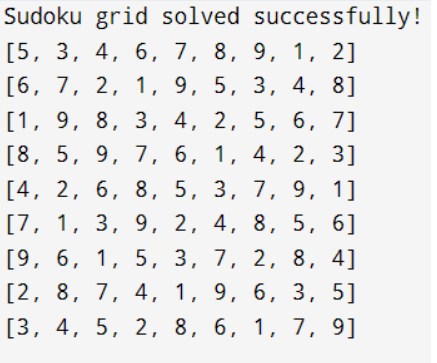

# Implement a Sudoku Solver From Scratch
## Steps to solve the Sudoku Puzzle in Python
<ol>
  <li>In this method for solving the sudoku puzzle, first, we assign the size of the 2D matrix to a variable M (M*M).</li>
 <li>Then we assign the utility function (puzzle) to print the grid.</li>
<li>Later it will assign num to the row and col.</li>
<li>If we find the same num in the same row or same column or in the specific 3*3 matrix, ‘false’ will be returned.</li>
<li>Then we will check if we have reached the 8th row and 9th column and return true for stopping further backtracking.</li>
<li>Next, we will check if the column value becomes 9 then we move to the next row and column.</li>
<li>Further now we see if the current position of the grid has a value greater than 0, then we iterate for the next column.</li>
<li>After checking if it is a safe place, we move to the next column and then assign the num in the current (row, col) position of the grid. Later we check for the next possibility with the next column.</li>
<li>As our assumption was wrong, we discard the assigned num and then we go for the next assumption with a different num value
</li>
</ol>

## PROGRAM:

NAME: MARELLA HASINI

REGISTRATION NUMBER:212223240083
```

M = 9


def print_grid(grid):
    for row in grid:
        print(row)


def is_safe(grid, row, col, num):
    
    for x in range(9):
        if grid[row][x] == num:
            return False

    
    for x in range(9):
        if grid[x][col] == num:
            return False

    
    start_row = row - row % 3
    start_col = col - col % 3
    for i in range(3):
        for j in range(3):
            if grid[i + start_row][j + start_col] == num:
                return False

    return True

def solve_sudoku(grid, row=0, col=0):
    
    if row == M - 1 and col == M:
        return True

    
    if col == M:
        row += 1
        col = 0


    if grid[row][col] > 0:
        return solve_sudoku(grid, row, col + 1)

    
    for num in range(1, M + 1):
        
        if is_safe(grid, row, col, num):
            grid[row][col] = num

            
            if solve_sudoku(grid, row, col + 1):
                return True

        
        grid[row][col] = 0

    return False

if __name__ == "__main__":
    puzzle = [
        [5, 3, 0, 0, 7, 0, 0, 0, 0],
        [6, 0, 0, 1, 9, 5, 0, 0, 0],
        [0, 9, 8, 0, 0, 0, 0, 6, 0],
        [8, 0, 0, 0, 6, 0, 0, 0, 3],
        [4, 0, 0, 8, 0, 3, 0, 0, 1],
        [7, 0, 0, 0, 2, 0, 0, 0, 6],
        [0, 6, 0, 0, 0, 0, 2, 8, 0],
        [0, 0, 0, 4, 1, 9, 0, 0, 5],
        [0, 0, 0, 0, 8, 0, 0, 7, 9]
    ]

    if solve_sudoku(puzzle):
        print("Sudoku grid solved successfully!")
        print_grid(puzzle)
    else:
        print("No solution exists for the given Sudoku puzzle.")
```

## OUTPUT:



## RESULT:
Thus the python program to implement a sudoko solver from scratch is executed sucessfully.
